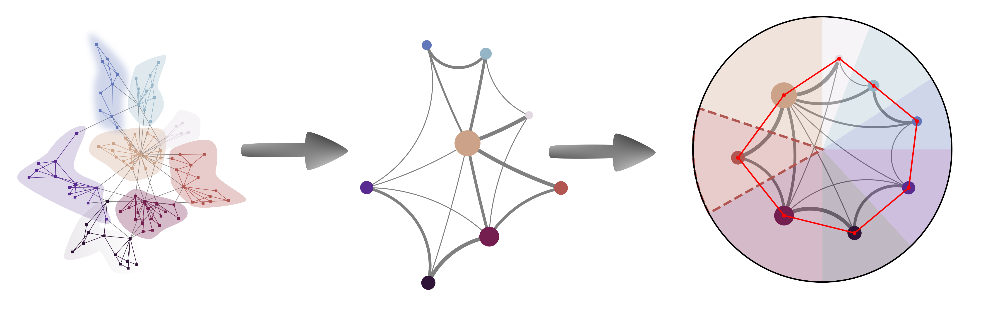

# CLOVE: A Travelling Salesman’s Approach to Hyperbolic Embeddings of Complex Networks with Communities

  
*Sámuel G. Balogh, Bendegúz Sulyok, Tamás Vicsek & Gergely Palla.*  
[CLOVE, a Travelling Salesman’s approach to hyperbolic embeddings of complex networks with communities](https://www.nature.com/articles/s42005-025-02306-8)  
https://www.nature.com/articles/s42005-025-02306-8


---

## Table of Contents
- [Citation](#citation)
- [About CLOVE](#aboutclove)
- [Import & Run](#import&run)
- [Input Parameters](#inputs)

---

## Citation
If you use this code, please cite:

```bibtex
@article{Balogh2025CLOVE,
  title     = {CLOVE, a Travelling Salesman’s approach to hyperbolic embeddings of complex networks with communities},
  author    = {Balogh, S{\'a}muel G. and Sulyok, Bendeg{\'u}z and Vicsek, Tam{\'a}s and Palla, Gergely},
  journal   = {Communications Physics},
  volume    = {8},
  year      = {2025},
  article   = {397},
  publisher = {Nature Publishing Group},
  doi       = {10.1038/s42005-025-02397-0},
  url       = {https://www.nature.com/articles/s42005-025-02397-0},
  note      = {Open access, published 10 October 2025}
}
```
---

## About CLOVE

**CLOVE** (short for **C**_luster_ **L**_evel_ **O**_ptimized_ **V**_ertex_ **E**_mbedding_) is a scalable method for embedding networks into two-dimensional hyperbolic space. It combines **community detection** with an optimization strategy inspired by the **Travelling Salesman Problem (TSP)** to hierarchically arrange communities and sub-communities, down to individual nodes.  

The paper details the algorithmic foundations of CLOVE, its implementation, and demonstrates its performance on both synthetic and real-world networks. See (https://www.nature.com/articles/s42005-025-02306-8)

For a detailed description of the corresponding code see the ```hypCLOVE_tutorial.ipynb``` notebook [here](hypCLOVE_tutorial.ipynb).


## Import & Run

If the **CLOVE** package is already installed, you can import it like this:

```python
import hypCLOVE.hypCLOVE as clove
```
Then generate, e.g. a Barabási–Albert graph in networkX and embed it:

```python
G = nx.barabasi_albert_graph(n=1000, m=2)

emb = clove.embed(G)
```
The whole set of input parameters of the ```.embed()``` function are listed below. For the outputs stored in the ```emb``` variable, see the ```hypCLOVE_tutorial.ipynb``` notebook [here](hypCLOVE_tutorial.ipynb).

## Input Parameters

### **`G`**  
- **Type:** `nx.Graph`  
- **Description:** The input network to be embedded.  

---

### **`gamma` (Degree Decay Exponent)**  
- **Type:** `float` or `None`  
- **Default:** `None`  
- **Description:**  
  - If `None`, the algorithm fits `gamma` based on the degree distribution.  
  - Otherwise, a fixed value `gamma ∈ (2, ∞)` is used.  

---

### **`deg_fit_sample` (Degree Fitting Sample Size)**  
- **Type:** `int`  
- **Default:** `100`  
- **Description:** Specifies how many node degrees are used to fit the degree distribution (only relevant if `gamma=None`).  

---

### **`dendrogram` (Multi-level Communities)**  
- **Type:** list of `dict`-s or `None`  
- **Default:** `None`  
- **Description:**  
  - If `None`, the algorithm automatically detects communities in a nested manner (recursively on induced subgraphs). 
  - Otherwise, a predefined dendrogram (as described [here](https://python-louvain.readthedocs.io/en/latest/api.html)) is used.
  - **When using CLOVE with a predefined dendrogram, each node must have a community label at the lowest level of the dendrogram. Additionally, community IDs at the lowest level of the dendrogram must be consecutive integers from 0 to $n$, where $n$ is the total number of communities at level zero.**

---

### **`local_partitioning` (Community Detection Method)**  
- **Type:** `callable`  
- **Default:** `Leiden`  
- **Description:**  
  - A function returning a dictionary where keys are nodes and values are their community labels.  
  - If `dendrogram=None`, this method is used for community detection.  
  - If both `dendrogram` and `local_partitioning` are `None`, the algorithm creates a dendrogram by Louvain.  

---

### **`coarsening_method` (Pre-weighting Scheme)**  
- **Type:** `callable`  
- **Default:** `exponential_coarsening`  
- **Description:** Applies a pre-weighting scheme to the graph and to the subgrahs induced by the communities.  

---

### **`anchor_num` (Anchor Communities)**  
- **Type:** `int`  
- **Default:** `1`  
- **Description:** Controls how many higher-level communities (anchor nodes) are considered when arranging the (sub-)communities.  
  - The minimum value is `0`.  
  - The maximum is `rm = (q0 / 2) - 1`, where `q0` is the number of top-level communities.  

---

### **`arrangement_method` (Community Arrangement Algorithm)**  
- **Type:** `str` or `callable`  
- **Default:** `'tsp_christofides'`  
- **Description:** Specifies the algorithm used to solve the **Traveling Salesman Problem (TSP)** for community ordering.  
- **Built-in options:**
  - `'tsp_christofides'`
  - `'tsp_greedy'`
  - `'tsp_simulated_annealing'`
  - `'tsp_threshold_accepting'`
  - A **custom callable function** returning a valid ordering.  

  **Boosting Options:**
  - `'sa'` → simulated annealing  
  - `'ta'` → threshold accepting  
  - Example usage: `'christofides+sa'` for boosting the Christofides TSP solver.  

---

### **`nodewise_level` (Node Arrangement at Lowest Level)**  
- **Type:** `str`  
- **Default:** `'degree_greedy'`  
- **Description:** Defines how nodes at the lowest-level communities are arranged.  
- **Options:**  
  - `'degree_greedy'` → Highest-degree node at the center, others sorted by decreasing degree.  
  - `'random_equidistant'` →  Nodes are randomly placed, but equidistant.  
  - `'nodewise_arrangement'` → Uses the method specified in `arrangement_method`.  
  - `None` → No specific arrangement; nodes in the lowest-level communities share the same angular coordinate.  

---

### **`comm_sector_size_prop` (Community Sector Sizing)**  
- **Type:** `str`  
- **Default:** `'node_num'`  
- **Description:** Determines the size of angular sectors communities occupy.  
- **Options:**  
  - `'node_num'` → Proportional to the number of nodes in the community.  
  - `'edge_num'` → Proportional to the number of edges in the community.  

---

### **`return_cartesian` (Coordinate Format)**  
- **Type:** `bool`  
- **Default:** `True`  
- **Description:**  
  - `True` → Returns coordinates in **Cartesian** format (x, y).  
  - `False` → Returns coordinates in **Polar** format (r, θ).  

---

### **`inplace` (Modify Input Graph)**  
- **Type:** `bool`  
- **Default:** `False`  
- **Description:**  
  - `True` → Modifies `G` in place with the computed coordinates.  
  - `False` → Returns computed values separately, leaving `G` unchanged.  

---

### **`cc_decomposition` (Handle Connected Components)**  
- **Type:** `bool`  
- **Default:** `True`  
- **Description:**  
  - If `True`, each connected component is arranged separately at the highest level.  
  - Only applicable when `dendrogram=None`.  

---

### **`k0_decomposition` (Isolated Node Handling)**  
- **Type:** `bool`  
- **Default:** `False`  
- **Description:**  
  - If `True`, isolated nodes (degree `0`) are removed and assigned **random angular coordinates**.  
  - Only applicable when `dendrogram=None`.  

---

### **`k1_decomposition` (Degree-1 Node Handling)**  
- **Type:** `bool`  
- **Default:** `False`  
- **Description:**  
  - If `True`, degree-1 nodes **inherit the angular coordinate** of their only neighbor.  
  - Only applicable when `dendrogram=None`.  

---

### **`rad_assignment` (Radial Coordinate Assignment)**  
- **Type:** `callable`  
- **Default:** `assign_PSO_radial_coordinates`  
- **Description:** A function that assigns radial coordinates to nodes.  

---

### **`seed` (Random Seed for Reproducibility)**  
- **Type:** `int` or `None`  
- **Default:** `None`  
- **Description:** Sets a random seed for reproducibility of results.  
